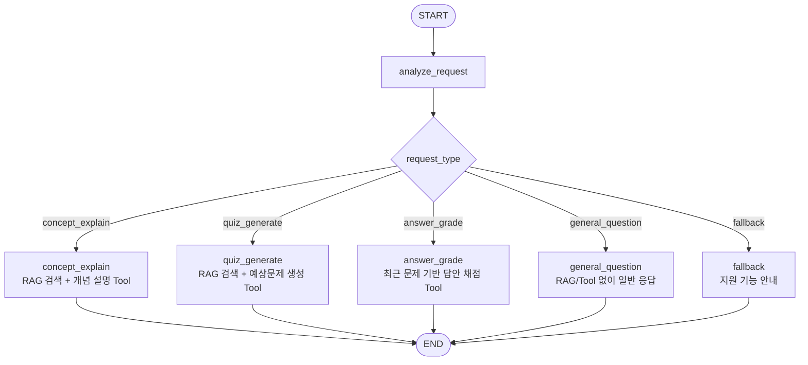
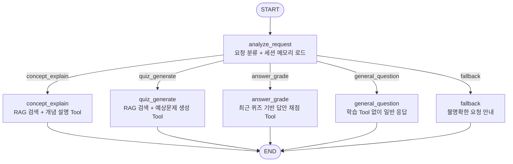

# Lecture Exam Coach Agent

강의 PDF를 기반으로 시험 공부를 돕는 FastAPI 기반 Agent 서비스입니다. 사용자는 강의 자료를 인덱싱한 뒤 개념 설명, 예상문제 생성, 답안 채점을 한 화면에서 수행할 수 있습니다. Agent API에는 Middleware와 운영 안정성 가드레일을 적용했습니다.

## 서비스 소개 및 사용 시나리오

이 서비스는 `data/pdfs` 폴더에 저장된 강의 PDF를 RAG 검색 대상으로 사용합니다. 사용자가 질문을 입력하면 LangGraph Agent가 요청 의도를 분류하고, 필요한 경우 PDF 검색 결과를 Tool에 전달해 학습용 응답을 생성합니다.

대표 사용 시나리오:

1. 사용자가 강의 PDF를 `data/pdfs`에 넣고 `/api/pdfs/index` 또는 웹 UI의 인덱싱 버튼을 실행합니다.
2. "TCP 3-way handshake 설명해줘"처럼 개념 설명을 요청하면 PDF 기반 근거와 함께 설명을 받습니다.
3. "LAN 단원 예상문제 만들어줘"처럼 요청하면 객관식 문제, 정답, 해설, 출처를 받습니다.
4. 생성된 문제에 대한 답안을 입력하면 Agent가 최근 문제와 기준 답안을 바탕으로 채점합니다.
5. `/api/sessions/{session_id}`로 대화 이력, 최근 문제, 최근 답안, 약점 태그, 채점 결과를 확인합니다.

## 구현 범위

- FastAPI 앱 엔트리포인트
- `/health` 헬스체크 API
- LangChain / LangGraph 기반 Agent 구조
- PDF 기반 RAG 인덱싱 및 검색 함수
- 시험공부 코치용 Tool 3종
- LLM Router와 LangGraph StateGraph 기반 Agent 흐름
- 세션 기반 메모리와 구조화된 채점 결과
- Agent, PDF 인덱싱, 세션 조회 FastAPI 엔드포인트
- 요청/응답 로깅 Middleware와 공통 에러 처리
- 채팅 입력 길이 제한, PDF 미인덱싱 가드레일, 일반 질문 분리 라우팅
- 빌드 없는 정적 웹 UI
- `.env` 기반 설정 로딩
- 기본 의존성 목록

## 전체 아키텍처

```mermaid
flowchart LR
    User[사용자] --> Web[정적 Web UI<br/>app/web]
    Web --> ChatAPI[POST /api/chat]
    Web --> PdfAPI[POST /api/pdfs/index]
    Web --> SessionAPI[GET /api/sessions/{session_id}]

    ChatAPI --> Middleware[OperationsMiddleware<br/>로깅, 처리시간 헤더, 에러 응답]
    PdfAPI --> Middleware
    SessionAPI --> Middleware

    Middleware --> Agent[LangGraph Agent<br/>app/agent/graph.py]
    Agent --> Router[요청 분류<br/>LLM Router + Rule Fallback]
    Router --> Tools[Study Coach Tools]
    Router --> General[일반 질문 응답]
    Router --> Fallback[가이드 응답]

    Tools --> RAG[RAG Pipeline<br/>retrieve_context]
    RAG --> Store[(Local Vector Store<br/>data/vector_store/index.json)]
    PdfAPI --> Indexer[index_pdfs]
    Indexer --> Loader[PDF Loader]
    Loader --> Splitter[Text Splitter]
    Splitter --> Embeddings[OpenAI Embeddings]
    Embeddings --> Store

    Agent --> Memory[(In-memory Session Store)]
    SessionAPI --> Memory
    Tools --> LLM[OpenAI Chat Model]
    General --> LLM
```

아키텍처는 API 계층, Agent 계층, RAG 계층, Memory 계층, Web UI 계층으로 나뉩니다. FastAPI는 정적 UI와 API를 제공하고, LangGraph Agent는 사용자의 요청을 분류한 뒤 Tool 또는 일반 응답 경로로 라우팅합니다. RAG 파이프라인은 PDF를 청크 단위로 인덱싱하고 로컬 JSON 벡터스토어를 통해 검색합니다.

## LangGraph Workflow

`app/agent/graph.py`는 LLM Router로 사용자 요청 의도를 먼저 분류한 뒤 조건부 분기로 필요한 Tool 노드를 실행합니다. OpenAI API Key가 없거나 LLM 분류가 실패하면 키워드 기반 fallback 분류를 사용합니다.

분류 타입은 `concept_explain`, `quiz_generate`, `answer_grade`, `general_question`, `fallback`입니다. `general_question`은 날씨, 뉴스, 잡담처럼 강의 PDF 기반 학습 기능과 무관한 요청이며, RAG와 학습 Tool을 호출하지 않고 LLM이 직접 답변합니다. 단, 웹 검색 도구가 없으므로 실시간 정보가 필요한 질문은 확인할 수 없다고 답하도록 제한합니다.

Workflow 다이어그램은 `draw_workflow_mermaid()`로 생성할 수 있으며, 현재 흐름은 아래와 같습니다.

```python
from app.agent import draw_workflow_mermaid, get_graph

agent = get_graph()
result = agent.invoke(
    {
        "user_id": "demo-user",
        "session_id": "demo-session",
        "user_message": "Agentic AI 개념 설명해줘",
    }
)

mermaid = draw_workflow_mermaid()
```



현재 분기:

```text
analyze_request
├── concept_explain
├── quiz_generate
├── answer_grade
├── general_question
└── fallback
```

## 프로젝트 구조

```text
.
├── app
│   ├── main.py
│   ├── web
│   │   ├── index.html
│   │   └── static
│   │       ├── app.js
│   │       └── styles.css
│   ├── api
│   │   ├── chat.py
│   │   ├── errors.py
│   │   ├── health.py
│   │   ├── pdfs.py
│   │   └── sessions.py
│   ├── middleware
│   │   └── operations.py
│   ├── memory
│   │   └── store.py
│   ├── core
│   │   └── config.py
│   ├── agent
│   │   └── graph.py
│   ├── rag
│   │   ├── embeddings.py
│   │   ├── pdf_loader.py
│   │   ├── pipeline.py
│   │   ├── text_splitter.py
│   │   └── vector_store.py
│   ├── tools
│   │   └── study_tools.py
│   └── schemas
│       ├── api.py
│       ├── agent.py
│       ├── health.py
│       ├── rag.py
│       └── tools.py
├── data
│   └── pdfs
├── .env.example
├── requirements.txt
└── README.md
```

## 설치 및 실행

```bash
python -m venv .venv
source .venv/bin/activate  # Windows PowerShell: .venv\Scripts\Activate.ps1
pip install -r requirements.txt
cp .env.example .env
uvicorn app.main:app --reload --port 3000
```

또는 `main.py`를 직접 실행할 수 있습니다.

```bash
python app/main.py
```

실행 후 웹 UI는 아래 주소에서 확인할 수 있습니다.

```text
http://127.0.0.1:3000/
```

Windows PowerShell에서는 아래처럼 `.env` 파일을 만들고, `.env`의 `PORT` 값을 사용해 실행할 수 있습니다.

```powershell
Copy-Item .env.example .env
$env:PORT = (Get-Content .env | Where-Object { $_ -match '^PORT=' } | ForEach-Object { ($_ -split '=', 2)[1].Trim('"') })
uvicorn app.main:app --reload --port $env:PORT
```

## API Key 관리

API Key는 코드에 하드코딩하지 않고 `.env`에서만 읽습니다. 필요한 값은 `.env.example`을 복사한 뒤 `.env`에 채워 넣습니다.

```env
OPENAI_API_KEY=""
OPENAI_CHAT_MODEL="gpt-4o-mini"
PORT=3000
PDF_DIR="data/pdfs"
VECTOR_STORE_PATH="data/vector_store/index.json"
```

## 사용된 Tool / RAG / Memory / Middleware

### Study Coach Tools

Agent가 선택해서 사용할 수 있는 Tool 3가지를 구현했습니다. Tool 입력과 출력은 Pydantic 스키마로 정의되어 있습니다.

```python
from app.tools import (
    STUDY_TOOLS,
    answer_grade_tool,
    concept_explain_tool,
    quiz_generate_tool,
)

concept_result = concept_explain_tool.invoke(
    {
        "user_question": "HTTP 상태 코드는 무엇인가요?",
        "rag_context": [],
    }
)

quiz_result = quiz_generate_tool.invoke(
    {
        "topic": "HTTP 상태 코드",
        "question_type": "multiple_choice",
        "count": 3,
        "difficulty": "medium",
        "rag_context": [],
    }
)

grade_result = answer_grade_tool.invoke(
    {
        "user_answer": "사용자 답안",
        "question": "최근 생성된 문제",
        "correct_answer": "기준 답안",
        "rag_context": [],
    }
)
```

- `concept_explain_tool`: 사용자 질문과 RAG 검색 결과를 바탕으로 개념 설명, 핵심 포인트, 출처, 후속 질문을 반환합니다.
- `quiz_generate_tool`: 특정 주제에 대해 객관식 또는 단답형 예상문제를 생성하고 정답, 해설, 출처를 반환합니다.
- `answer_grade_tool`: 사용자의 답안을 채점하고 JSON 구조의 결과를 반환합니다.

### RAG 파이프라인

`data/pdfs` 폴더의 PDF를 읽어 페이지 단위로 텍스트를 추출하고, 설정된 길이로 청크를 나눈 뒤 OpenAI Embedding을 생성합니다. 생성된 벡터는 `data/vector_store/index.json`에 저장되며, 이 경로는 런타임 산출물이므로 Git에는 포함하지 않습니다.

주요 함수:



```python
from app.rag import get_retriever, index_pdfs, retrieve_context

index_pdfs()
contexts = retrieve_context("HTTP 상태 코드 개념 설명해줘")
retriever = get_retriever(top_k=4)
```

검색 결과에는 Agent가 답변 출처로 사용할 수 있도록 `source`, `page`, `text`, `score`, `chunk_id`가 포함됩니다.

### Memory / Structured Output

`app/memory/store.py`는 `session_id` 기준으로 대화 이력, 최근 문제, 최근 답안, 채점 결과, 누적 약점 태그를 저장합니다. 현재는 과제 MVP에 필요한 인메모리 저장소이며, 서버 재시작 시 초기화됩니다.

채점 결과는 Pydantic parser를 사용하는 `AnswerGradeOutput` 구조로 반환됩니다.

```json
{
  "is_correct": false,
  "score": 50,
  "correct_answer": "이전 문제의 정답",
  "explanation": "채점 해설",
  "weakness_tags": ["needs_concept_review"],
  "next_review_action": "관련 개념을 다시 읽고 문제를 더 풉니다."
}
```

LangGraph에서는 `answer_grade`가 채점 결과, 점수, 해설, 정답/기준 답안, 오답 이유를 반환합니다. 여러 문항 답안을 줄별로 입력하면 문항별로 개별 채점합니다.

### Middleware / 운영 안정성

`app/main.py`에서 `OperationsMiddleware`와 공통 exception handler를 등록합니다. Middleware 구현 위치는 `app/middleware/operations.py`입니다.

- 모든 요청의 `method`, `path`, `status`, 처리 시간을 로그로 남깁니다.
- 모든 응답에 `X-Process-Time-Ms` 헤더를 추가합니다.
- 예상치 못한 예외는 `success=false`, `error_code`, `message` 형식의 공통 JSON으로 반환합니다.
- `/api/chat`의 `message`는 최대 1000자, `session_id`와 `user_id`는 최대 100자로 제한합니다.
- PDF 벡터스토어가 비어 있는 상태에서 개념 설명 또는 예상문제 생성을 요청하면 409 응답과 함께 먼저 `/api/pdfs/index`를 실행하라는 가드레일 메시지를 반환합니다.

## API

브라우저 UI는 아래 API를 `fetch()`로 호출합니다. API Key는 서버의 `.env`에서만 읽고 화면에는 노출하지 않습니다.

### POST `/api/chat`

자연어 요청을 받아 LangGraph Agent를 실행합니다.

```bash
curl -X POST http://127.0.0.1:3000/api/chat \
  -H "Content-Type: application/json" \
  -d "{\"session_id\":\"demo-session\",\"user_id\":\"demo-user\",\"message\":\"Agentic AI 개념 설명해줘\"}"
```

### POST `/api/pdfs/index`

`data/pdfs` 또는 요청으로 전달한 폴더의 PDF를 인덱싱합니다.

```bash
curl -X POST http://127.0.0.1:3000/api/pdfs/index \
  -H "Content-Type: application/json" \
  -d "{}"
```

### GET `/api/sessions/{session_id}`

세션별 대화 이력, 최근 문제, 최근 답안, 약점 태그, 채점 결과를 조회합니다.

```bash
curl http://127.0.0.1:3000/api/sessions/demo-session
```

API 오류는 아래처럼 공통 형식으로 반환합니다.

```json
{
  "success": false,
  "error_code": "agent_execution_failed",
  "message": "Agent 실행 중 문제가 발생했습니다. 잠시 후 다시 시도해주세요."
}
```

## 헬스체크

```bash
curl http://127.0.0.1:3000/health
```

예상 응답:

```json
{
  "status": "ok",
  "service": "Lecture Exam Coach Agent",
  "version": "0.1.0",
  "environment": "local"
}
```

`GET /`는 `app/web/index.html`을 반환하고, `/static/*`는 CSS와 JavaScript를 제공합니다. 한 화면에서 아래 작업을 수행할 수 있습니다.

- Agent 채팅 실행
- `data/pdfs` 폴더 PDF 인덱싱
- 현재 `session_id`에 저장된 대화 이력, 최근 문제, 최근 답안, 약점 태그, 채점 결과 조회

별도 프론트엔드 빌드 과정은 없습니다.

## 한계점 및 향후 개선 방향

현재 한계점:

- 세션 메모리가 인메모리 딕셔너리 기반이라 서버 재시작 시 초기화됩니다.
- 벡터스토어가 로컬 JSON 파일 기반이라 대용량 PDF나 동시 사용자 환경에는 적합하지 않습니다.
- PDF 내 표, 이미지, 수식 등 복잡한 레이아웃 추출 정확도는 원본 PDF 품질에 영향을 받습니다.
- 웹 검색 도구가 없으므로 날씨, 뉴스, 주가처럼 실시간 정보가 필요한 질문은 검증할 수 없습니다.
- 사용자 인증, 권한 관리, 파일 업로드 UI는 포함되어 있지 않습니다.

향후 개선 방향:

- Redis, PostgreSQL, SQLite 등을 사용한 영속 세션 메모리 도입
- Chroma, FAISS, pgvector 등 검색 전용 벡터 DB 연동
- PDF 업로드 UI와 인덱싱 상태 표시 기능 추가
- 문제 유형, 난이도, 문항 수를 사용자가 세밀하게 조절하는 옵션 추가
- 채점 결과 기반 약점 분석과 복습 계획 추천 기능 확장
- LangSmith 추적을 활용한 Agent 실행 로그 관찰성 강화
- 인증과 사용자별 자료 분리 기능 추가
